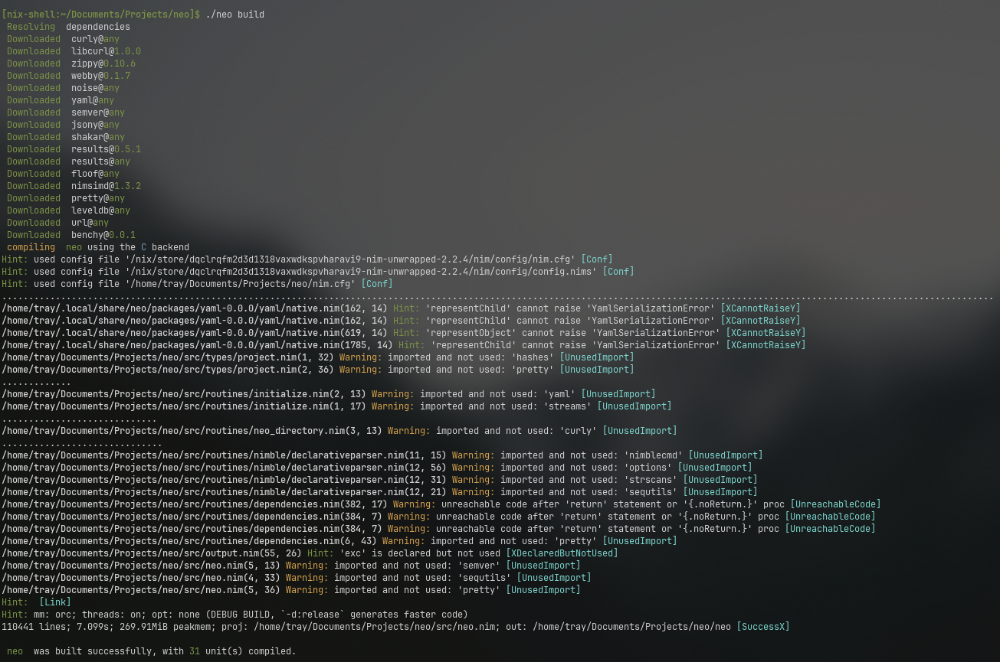

# neo


Neo is a new package manager for the [Nim programming language](https://nim-lang.org). It aims to:
- Have a clean, maintainable codebase
- Be simple to use
- Fix everything Nimble does badly
- Be as fast as possible (this includes multithreading)
- Interoperate with the existing Nimble infrastructure so that packages using Neo can easily be uploaded to the Nimble index
- Using modern algorithms since we're not scared of breaking things (like using SHA-256 for hashing)
- Add infrastructure for "custom targets" like WASM

# Roadmap
Neo is currently a ~2.1K LoC project, and has the following features ready and working:
- [X] Internal storage area (`~/.local/share/neo`)
- [X] Package lists/indices (stored at `~/.local/share/neo/indices`)
- [X] Internal state is stored as a LevelDB database (at `~/.local/share/neo/state`)
- [X] `neo build` command
- [X] `neo search` command
- [X] `neo init` command
- [X] `neo search` command
- [X] `neo info` command
- [X] `neo add` command
- [X] Forge aliases
- [X] Dependency solver
- [X] Proper dependency management
- [X] Lockfiles (**partially**)
- [X] Dependency hash pinning

The following are pending tasks that will hopefully be completed soon:
- [ ] Tasks
- [ ] Hooks

# Building Neo
Neo can be built using Neo itself, or via Nimble. To build it via itself, run:
```
$ neo build
```

# Dependencies
- libcURL
- LevelDB
- git

# Usage
## Creating a project
```command
$ neo init myproject
  Project Type:
    1. Binary
    2. Library
    3. Hybrid
  
  License: GPL3

  Description: A super awesome Nim project

  Backend:
    > C
    > C++
    > JavaScript
    > Objective-C
```

## Building your project
```command
$ neo build --arguments --here --are --passed --to --nim
Building myproject with the C backend
```

## Searching for packages
```command
$ neo search url

 url  A high-performance URL parser based on the WHATWG standard.
 urlly  URL and URI parsing for C and JS backend.
 urlon  URL Object Notation implemented in Nim
 gurl  A little lib for generating URL with args.
 curly  Makes using libcurl efficiently easy
 unroll  unroll for-loops (and map into seq/array) at compile-time in nim
 curlies  A macro for object construction using {} (curlies).
 libcurl  Nim wrapper for libcurl.
 openurl  Open Any Url/File in the default App / WebBrowser.
 unrolled  Unroll for-loops at compile-time.
 urlshortener  A URL shortener cli app. using bit.ly
 dataUrl  Easily create data urls! CLI included
 shorturl  Nim module for generating URL identifiers for Tiny URL and bit.ly-like URLs
 osureplay  osu! replay parser
 surrealdb  SurrealDB driver for Nim

 ...  and 7 packages more (use --limit:<N> to see more)
```

## Fetching information for a package
This causes the package to be downloaded, so that its
additional metadata can be explored.

```command
$ neo info jester
 Downloaded  jester@any
jester #web #http #framework #dsl
A sinatra-like web framework for Nim.
version: 0.6.0
license: MIT
documentation: https://github.com/dom96/jester
 notice  This project only has a `.nimble` file. If you own it, consider adding a `neo.toml` to it as well.
```
